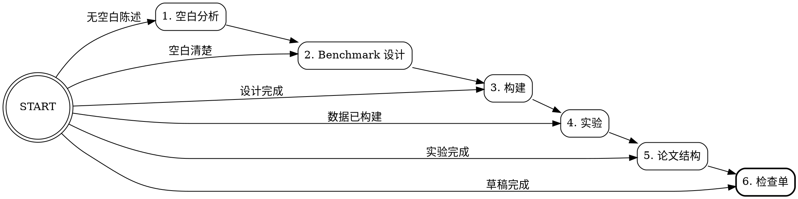

# Benchmark/评估论文写作系统

面向顶级 AI 会议（NeurIPS、ICLR、ICML、ACL、EMNLP、CVPR）的 Benchmark/评估论文系统化写作工作流。

## 核心理念

Benchmark 论文的叙事轴线与技术论文根本不同：

| 维度 | 技术论文 | Benchmark 论文 |
|------|----------|----------------|
| 核心声称 | "我们的方法更好" | "这个评估维度被忽视了" |
| 问题定义的角色 | 一句话目标 | 问题定义就是贡献（定义"评估什么"、"怎么测量"、"出现什么洞察"） |
| Introduction 轴线 | 关键想法 / 机制 | 评估空白 + Benchmark 设计理由 |
| 主要章节 | 方法/途径（最大节） | 构建管线是核心；伴随方法是加分。对 VLDB 评估论文，评估维度和视角是关键。 |
| 实验目标 | 证明 SOTA | 揭示模型能力边界 + 未来研究深度洞察 |
| 关键图表 | 架构图 | Benchmark 对比表 + 构建管线图 + 多维分析图 |
| 关键贡献 | 新技术 | 新评估范式 + 实证发现 |

**Benchmark 论文的核心不是"提出一个数据集"，而是定义新的评估维度、提供系统化测量基础设施、揭示关于模型能力的深度洞察。**

空白和动机必须显式化。论文需要在自己的 Introduction 中明确说明为什么这个 Benchmark 或评估论文需要存在。

## 五支柱

每篇优秀的 Benchmark 论文都涉及这五个要素：

1. **研究空白**（评估盲区），一个清晰、可辩护的评估盲区
2. **构建管线**（构建方法论），系统、可扩展、高质量的数据创建
3. **评估框架**（评估框架细节），多维分类法与细粒度诊断
4. **实证发现**（实证洞察），超越排行榜数字的洞察，带"Finding X"摘要
5. **伴随方法**（伴随方法，可选但推荐），利用该 Benchmark 改进能力的模型

## 阶段检测与路由



调用时询问用户：**"Benchmark 论文目前处于哪个阶段？"** 并呈现：

| 阶段 | 条件 | 调用技能 | 回答的关键问题 |
|------|------|----------|----------------|
| 1. 空白分析 | 仍在探索为什么需要此 Benchmark | `bench-gap-analysis` | 为什么需要这个 Benchmark？ |
| 2. Benchmark 设计 | 空白确认，正在设计 Benchmark 系统 | `bench-design` | Benchmark 长什么样？ |
| 3. 构建管线 | 设计锁定，规划数据构建管线 | `bench-construction` | 数据如何构建？ |
| 4. 实验设计 | 数据就绪或在建，需设计实验 | `bench-experiments` | 什么实验揭示最深洞察？ |
| 5. 论文结构 | 实验完成，正在写论文 | `bench-paper-structure` | 如何组织和写论文？ |
| 6. 投稿前检查单 | 初稿完成，运行投稿前检查 | `bench-checklist` | 论文可投稿了吗？ |

如用户描述情况而未选编号，从上下文推断阶段并在路由前确认。

## 参考范例

本技能系统以三篇已发表的 Benchmark 论文作为反复出现的案例研究：

| 论文 | 会议 | 领域 | 关键创新 |
|------|------|------|----------|
| **StatQA** | NeurIPS 2024 | 数学/统计 | 逆向合成：先固定答案再生成问题 |
| **nvBench 2.0** | NeurIPS 2025 | Text-to-Visualization | 从无歧义种子受控注入歧义 |
| **VisJudge-Bench** | ICLR 2026 | 可视化评估 | 自适应问题生成 + 3 阶段专家标注 |

每个子技能引用这些论文作为成功策略的具体示例。详细的实例化模板见 `references/instantiation-template.md`。

## 推荐论文结构

供参考，推荐的章节结构：

```
第 1 节：Introduction（1.5 页）
第 2 节：提出的 Benchmark（3-4 页），核心章节
第 3 节：专用模型/方法（1-2 页，可选）
第 4 节：实验与实证发现（4-5 页）
第 5 节：讨论与研究机会（1 页）
第 6 节：Related Work（1 页）
第 7 节：结论（0.5 页）
```
